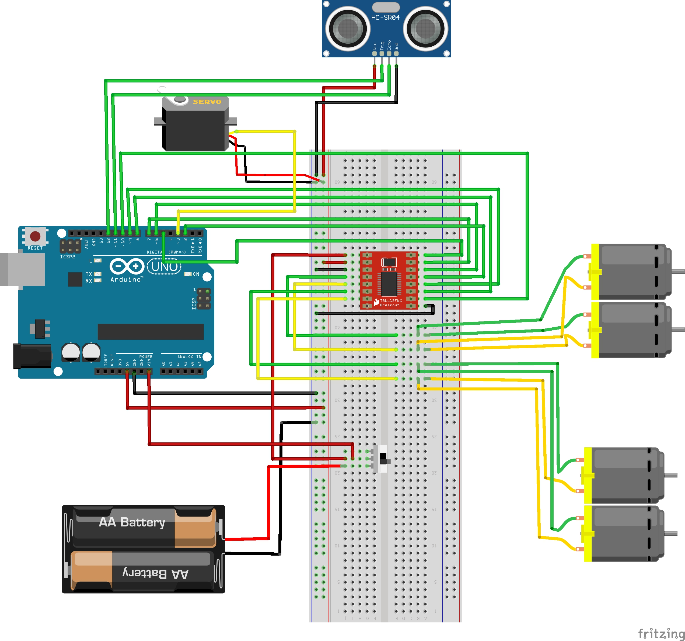

# Obstacle Avoiding Robot

This project is about building an autonomous robot that can navigate its environment and avoid obstacles. Utilizing an ultrasonic sensor for distance measurement, the robot changes direction when it detects objects closer than a predefined threshold. It's designed for educational purposes, showcasing basic robotics, sensor integration, and programming concepts.

## Features

- **Autonomous Navigation:** The robot moves forward continuously and autonomously changes direction when detecting obstacles.
- **Obstacle Detection:** Utilizes an ultrasonic sensor to detect obstacles within a 20 cm range.
- **Directional Control:** The robot can move forward, backward, left, and right, adjusting its path based on obstacle proximity.
- **Servo Motor for Sensor Scanning:** Incorporates a servo motor to rotate the ultrasonic sensor for a wider range of detection.

## Components

- Arduino Uno or any compatible microcontroller
- Robot Chasis/Frame
- TB6612FNG Motor Driver
- Ultrasonic sensor (HC-SR04)
- Servo motor
- 4 DC motors with wheels
- Breadboard and jumper wires
- Power supply (battery)

## Circuit Diagram

## Setup and Installation

1. **Assemble the Robot:** Follow the circuit diagram to connect the motors, ultrasonic sensor, and servo motor to the Arduino board.
2. **Install Arduino IDE:** If not already installed, download and install the Arduino IDE from [the official website](https://www.arduino.cc/en/software).
3. **Install Libraries:** Open the Arduino IDE, navigate to `Sketch` > `Include Library` > `Manage Libraries...`, and install the `Servo` library.
4. **Upload the Code:** Connect your Arduino to your computer via USB, open the provided code in the Arduino IDE, select the correct board and port under `Tools`, and click `Upload`.

## Usage

After uploading the code to the Arduino, power the robot with a battery. The robot will start moving forward, automatically avoiding obstacles by changing directions.

## Robot in Action

## Contributing

Feel free to fork the project and submit pull requests if you have suggestions for improvements or new features.

